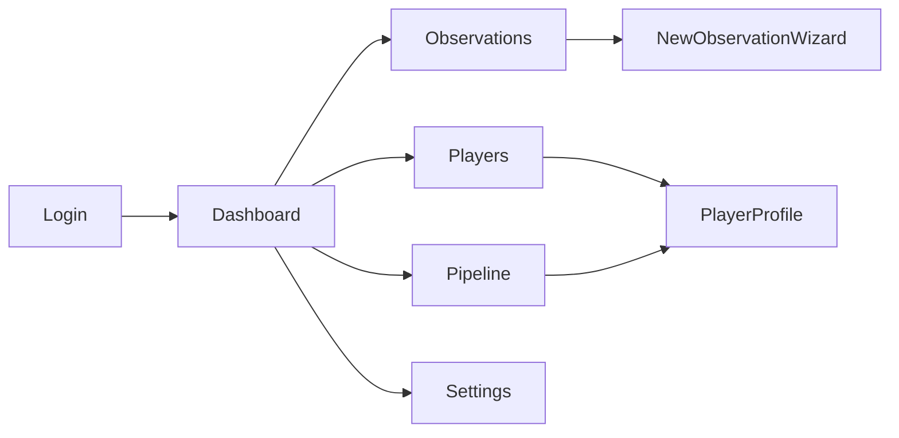
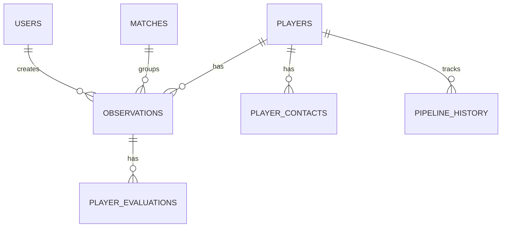

# ScoutPro - opis aplikacji i wymagania

Dokument jest jednolitym opisem aplikacji ScoutPro dla programisty rozpoczynajacego implementacje. Zawiera cel produktu, strukture informacji, powiazania miedzy widokami i funkcjami oraz zakres prezentowanych danych.

## 1. Cel aplikacji i wartosc biznesowa
ScoutPro to mobilny system scoutingowy dla akademii pilkarskich. Glowny cel to:
- standaryzacja obserwacji zawodnikow,
- centralizacja danych i historii,
- przyspieszenie decyzji rekrutacyjnych,
- praca w trybie offline z pozniejsza synchronizacja.

## 2. Uzytkownicy i role
- Scout (glowny uzytkownik): dodaje obserwacje, pracuje offline, przeglada profile.
- Trener: przeglada profile zawodnikow i shortlisty.
- Dyrektor sportowy: analizuje KPI i konwersje pipeline.
- Administrator: zarzadza kontami i slownikami.

## 3. Zakres MVP i roadmapa
MVP obejmuje:
- logowanie i zaproszenia,
- obserwacje mobilne (wizard),
- profile zawodnikow 360,
- pipeline rekrutacyjny,
- dashboard KPI,
- offline mode.

Faza 2+ (po MVP): benchmarking, role i regiony, audit log, integracje, eksporty, raporty.

## 4. Kontekst techniczny (skrot)
- Frontend: React 18 + TypeScript + Vite + Tailwind + shadcn/ui.
- Backend: Supabase (PostgreSQL, Auth, Storage, Realtime).
- PWA: Service Worker (Workbox), IndexedDB (Dexie).
- Hosting: Vercel.

## 5. Struktura informacji i model danych (skrot)
Kluczowe encje:
- users: uzytkownicy i role.
- players: zawodnicy (profil 360).
- observations: obserwacje zawodnikow.
- matches: obserwowane mecze.
- player_contacts: kontakty do rodzicow/opiekunow.
- player_evaluations: oceny szczegolowe wg kryteriow pozycyjnych.
- pipeline_history: historia zmian statusow.
- slowniki: clubs, regions, leagues, categories, positions, evaluation_criteria.
- offline_queue: kolejka operacji offline.

Relacje kluczowe:
- users 1..N observations (scout_id).
- players 1..N observations.
- observations N..1 matches (opcjonalnie).
- players 1..N player_contacts.
- observations 1..N player_evaluations.
- players 1..N pipeline_history.

## 6. Widoki, funkcje i dane
Ponizej powiazanie widokow z funkcjami i danymi.

### 6.1 Login i zaproszenia
- Widoki: LoginPage, ResetPasswordPage, SetNewPasswordPage, AcceptInvitePage.
- Funkcje: logowanie, reset hasla, akceptacja zaproszenia, ustawienie hasla.
- Dane: users, invitations, auth session.

### 6.2 Dashboard
- Widok: DashboardPage.
- Funkcje: przeglad KPI, ostatnie obserwacje, top zawodnicy, pipeline summary.
- Dane: observations (ostatnie), players (top), statystyki pipeline.

### 6.3 Obserwacje
- Widoki: ObservationsPage, NewObservationPage, ObservationDetailPage, EditObservationPage.
- Funkcje: lista, filtrowanie, tworzenie (wizard), edycja, soft delete.
- Dane: observations, players (powiazane), player_evaluations, clubs, positions.

### 6.4 Zawodnicy
- Widoki: PlayersPage, PlayerDetailPage, NewPlayerPage, EditPlayerPage.
- Funkcje: lista, profil 360, tworzenie bez obserwacji, edycja profilu.
- Dane: players, player_contacts, observations, pipeline_history, clubs, regions.

### 6.5 Pipeline rekrutacyjny
- Widok: PipelinePage.
- Funkcje: Kanban, drag and drop, zmiana statusu, historia.
- Dane: players.pipeline_status, pipeline_history.

### 6.6 Ustawienia
- Widok: SettingsPage.
- Funkcje: CRUD slownikow (regiony, ligi, kluby, kryteria ocen), zarzadzanie uzytkownikami.
- Dane: regions, leagues, clubs, positions, evaluation_criteria, users.

## 7. Powiazania widokow i przeplywow (mermaid)

## 8. Przeplywy kluczowe (skrot)
1. Logowanie i zaproszenia:
   - Admin wysyla zaproszenie -> uzytkownik ustawia haslo -> loguje sie.
2. Dodanie obserwacji:
   - Wizard 4 kroki: dane zawodnika -> pozycja -> ocena -> zdjecie.
3. Profil zawodnika:
   - Profil 360 z danymi, historia obserwacji, status pipeline, kontakty, multimedia.
4. Zmiana statusu pipeline:
   - Drag and drop na Kanban -> wpis do pipeline_history -> aktualizacja statusu.

## 9. Offline i synchronizacja
Strategia offline-first:
- aplikacja dostepna offline (PWA + cache),
- obserwacje zapisywane lokalnie w IndexedDB,
- automatyczna synchronizacja po powrocie online,
- LWW (last write wins) dla konfliktow w MVP.

## 10. API i integracje (skrot)
API generowane przez Supabase PostgREST + Edge Functions:
- /rest/v1/players, /rest/v1/observations, /rest/v1/users, /rest/v1/clubs, /rest/v1/regions...
- Auth przez /auth/v1 (email/password).
- Edge Functions: send-invitation, accept-invitation.
- Storage: bucket player-photos.

## 11. Wymagania stylistyczne i UX
- Styl: nowoczesny, minimalistyczny, uporzadkowany.
- Kolor akcji (primary/CTA): czerwony.
- Kolory dodatkowe: czarny, bialy, odcienie szarosci.
- UX: wygodny, czytelne widoki, prosta nawigacja, jasne hierarchie informacji.
- Wyglad: atrakcyjny i spójny, z subtelnymi nawiazaniami do klubow pilkarskich (np. akcenty, typografia, ikonografia).

### 11.1 Komponenty UI - wytyczne
- Przyciski: primary (czerwony, wyrazny), secondary (szary), ghost (tekst/ikona); jeden glowny CTA na ekran.
- Formularze: duze pola dotykowe, wyrazne etykiety, komunikaty bledow pod polem, walidacja natychmiastowa.
- Karty: proste, z delikatnym cieniem i obramowaniem; klikane karty maja wyrazny hover.
- Listy i tabele: czytelne wiersze, spójne metadane (rocznik, klub, ranga), stale rozmieszczenie informacji.
- Badge/Status: wyrazne odznaki dla rang i statusow pipeline, bez nadmiaru kolorow poza czerwonym akcentem.
- Nawigacja: proste ikony, jednoznaczne etykiety, widoczny aktywny element.
- Modale i dialogi: minimalistyczne, z jednym glowym CTA i wyraznym przyciskiem anuluj.
- Panele i sekcje: konsekwentne marginesy i odstepy, czytelne tytuly sekcji.

### 11.2 Ikonografia i grafika
- Ikony: proste, jednolite stylistycznie, bez zbędnych ozdobnikow.
- Akcenty pilkarskie: subtelne (np. ikona pilki, motywy boiska w tle), nie dominujace.
- Zdjecia zawodnikow: wyrazne, z jednakowym formatem i kadrowaniem.

### 11.3 Typografia i czytelnosc
- Priorytet na czytelnosc w terenie (telefon, slabe oswietlenie).
- Wyrazne naglowki i hierarchia tekstu, ograniczona liczba rozmiarow fontu.
- Spójne skróty i etykiety (np. ranga, pozycja, status).

## 12. Wymagania niefunkcjonalne
- Wydajnosc: czas ladowania < 3s, API < 500ms p95.
- Dostepnosc: WCAG 2.1 AA, kontrast > 4.5:1.
- Bezpieczenstwo: HTTPS, RLS w bazie, walidacja inputow.
- Kompatybilnosc: Chrome 90+, iOS 14+, Android 10+.

## 13. Dane startowe i import
Zrodlo danych: plik Excel z historycznymi obserwacjami.
Mapowanie Excel -> baza:
- nazwisko/imie/rocznik/klub -> players
- data, ranga, opis -> observations
Import realizowany przez skrypt migracji/seed.

## 14. Minimalne wymagania uruchomieniowe
- Node.js 20, npm.
- Plik .env.local z:
  - VITE_SUPABASE_URL
  - VITE_SUPABASE_ANON_KEY
  - VITE_APP_URL
- Start: npm install, npm run dev.

## 15. Schemat relacji danych (mermaid)

## 16. Slownik pojec
- Obserwacja: raport z ogladania zawodnika.
- Pipeline: sekwencja statusow Observed -> Shortlist -> Trial -> Offer -> Signed/Rejected.
- Profil 360: pelny profil zawodnika z historia obserwacji.
- KPI: kluczowe wskazniki efektywnosci.
- PWA: aplikacja webowa z funkcjami offline.
