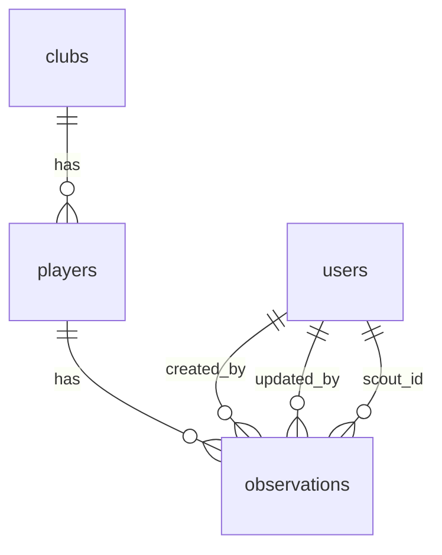

# Analiza formularzy obserwacji i plan ujednolicenia

## Cel
Porownanie formularzy nowej i edycji obserwacji z dwoch punktow wejscia oraz zaproponowanie
ujednolicenia zbierania danych, z uwzglednieniem ryzyka duplikatow zawodnikow i kontaktow.

## Scenariusze i wejscia
1. **Nowa obserwacja z listy obserwacji**
   - Wejscie: `ObservationsPage` -> `NewObservationPage`
   - Formularz: `ObservationWizard` bez `prefillPlayer`
2. **Edycja obserwacji z listy obserwacji**
   - Wejscie: `ObservationDetailPage` -> `EditObservationPage`
   - Formularz: `EditObservationPage`
3. **Nowa obserwacja z widoku szczegolow zawodnika**
   - Wejscie: `PlayerDetailPage` -> `NewObservationPage?playerId=...`
   - Formularz: `ObservationWizard` z `prefillPlayer`, `lockPlayerFields = true`
4. **Edycja obserwacji z widoku szczegolow zawodnika**
   - Wejscie: `ObservationDetailPage` (z kontekstu zawodnika) -> `EditObservationPage`
   - Formularz: `EditObservationPage` (rozni sie tylko powrotem)

## Zakres zbieranych danych (grupy logiczne)
Ponizej docelowy, logiczny podzial danych, ktory pozwala ujednolicic formularze:

### 1) Zawodnik (player)
- `full_name` -> `first_name`, `last_name`
- `age` -> `birth_year`
- `club_name` -> `club_id`
- `primary_position`

### 2) Mecz / kontekst obserwacji
- `match_date` -> `observation_date`
- `competition`

### 3) Ocena i notatki
- `overall_rating`
- `strengths`
- `weaknesses`
- `notes`
- `rank`
- `potential_now`
- `potential_future`

### 4) Zrodlo
- `source`

### 5) Media
- `photo_url`

### 6) Audyt
- `created_by`, `created_by_name`, `created_by_role`
- `updated_by`, `updated_by_name`, `updated_by_role`, `updated_at`

### 7) Pipeline (status zawodnika)
- `pipeline_status` (tylko w edycji obserwacji)

## Porownanie formularzy (pola i walidacje)

### A. Nowa obserwacja (ObservationWizard)
**Wymagane pola:**
- `full_name`, `age`, `match_date`, `primary_position`
- `overall_rating` (1-10, krok 0.5)
- `rank`
- `potential_now`, `potential_future` (1-5)
- `source`

**Opcjonalne pola:**
- `club_name`, `competition`, `strengths`, `weaknesses`, `notes`, `photo_url`

**Mapowanie:**
- `full_name` -> `first_name`, `last_name`
- `age` -> `birth_year`
- `club_name` -> `club_id` (resolve z tabeli `clubs`)
- Tworzy `players` (jesli brak `playerId`) lub aktualizuje (gdy `shouldUpdatePlayer`)
- Zawsze tworzy rekord w `observations`

**Offline:**
- Zapisuje payload do IndexedDB i synchronizuje pozniej

### B. Edycja obserwacji (EditObservationPage)
**Wymagane pola:**
- `full_name`, `age`, `match_date`, `primary_position`
- `overall_rating` (1-10, krok 0.5)
- `source`

**Opcjonalne pola:**
- `club_name`, `competition`, `strengths`, `weaknesses`, `notes`, `photo_url`
- `rank`, `potential_now`, `potential_future`
- `pipeline_status`

**Mapowanie:**
- Zawsze aktualizuje `players` (imie, nazwisko, rocznik, klub, pozycja)
- Aktualizuje `observations` (czesc pól moze zostac ustawiona na `null`)
- Dodatkowo moze aktualizowac `pipeline_status`

## Roznice i ryzyka (online/offline)
1. **Inne wymagania pol**
   - `rank`, `potential_now`, `potential_future` sa wymagane przy tworzeniu, ale opcjonalne przy edycji.
   - Ryzyko: edycja moze wyzerowac (NULL) dane, ktore byly wymagane przy tworzeniu.

2. **`pipeline_status` tylko w edycji**
   - Brak statusu w formularzu tworzenia obserwacji powoduje, ze status zawodnika jest ustawiany domyslnie.

3. **Inny zakres danych zawodnika**
   - `ObservationWizard` ogranicza sie do podstawowych danych zawodnika, nie zbiera kontaktow ani szczegolowych danych.
   - `PlayerForm` ma dodatkowe dane kontaktowe (guardian_*) i cechy fizyczne, ale nie sa one zbierane w obserwacji.

4. **Offline sync pomija niektore pola**
   - Przy tworzeniu zawodnika offline zapisywane sa tylko: imie, nazwisko, rocznik, pozycja.
   - `club_name` nie trafia do `players` podczas tworzenia offline.
   - `pipeline_status` nie jest ustawiany podczas tworzenia offline.
   - Ryzyko: zawodnik utworzony offline ma ubozsze dane niz online.

5. **Brak mechanizmu deduplikacji**
   - Tworzenie nowego zawodnika z obserwacji nie sprawdza istnienia podobnych rekordow.
   - Ryzyko: duplikaty zawodnikow, a w przyszlosci duplikaty kontaktow opiekunow.

## Propozycja ujednolicenia zbierania danych

### 1) Wspolny model danych (logiczny)
Utworzyc wspolna strukture danych formularza:
```ts
type ObservationFormModel = {
  player: {
    full_name: string;
    age: number;
    club_name?: string;
    primary_position: string;
    // opcjonalnie: kontakt opiekuna w przyszlosci
    guardian_name?: string;
    guardian_phone?: string;
    guardian_email?: string;
  };
  observation: {
    match_date: string;
    competition?: string;
    overall_rating: number;
    strengths?: string;
    weaknesses?: string;
    notes?: string;
    rank?: string;
    potential_now?: number;
    potential_future?: number;
    source: string;
    photo_url?: string;
  };
  audit: {
    created_by?: string;
    updated_by?: string;
    updated_at?: string;
  };
  pipeline_status?: string;
};
```

### 2) Jedno zrodlo walidacji i mapowania
- Wydzielic helpery do:
  - `parseFullName`
  - `resolveClubId`
  - mapowania `ObservationFormModel` -> `players` + `observations`
- Utrzymac spojne wymagania pol dla create i edit.

### 3) Spojne wymagania pol
Rekomendacja:
- `rank`, `potential_now`, `potential_future` wymagane **zawsze** (create i edit)
- `source` wymagane zawsze
- `overall_rating`, `match_date`, `primary_position` wymagane zawsze

### 4) Ujednolicenie online/offline
- Offline tworzenie zawodnika powinno przenosic te same pola co online
  (min. klub, pozycja, status).
- Offline sync powinien uzyc tego samego mapowania co online.

## Deduplikacja zawodnika i kontaktow (propozycja)

### Strategia identyfikacji
1. **Hard match**: `first_name + last_name + birth_year`
2. **Soft match**: jak wyzej + `club_id` lub czesciowa zgodnosc nazwiska
3. **Kontakty opiekuna** (gdy dostepne): `guardian_phone` lub `guardian_email`

### UX w formularzu obserwacji
- Po wpisaniu danych zawodnika pokaz liste "mozliwych duplikatow".
- Umozliw wybor istniejacego zawodnika lub potwierdzenie "to nowy zawodnik".
- Jezeli istnieje match po `guardian_email` lub `guardian_phone`, wymagaj potwierdzenia.

### Zapobieganie duplikatom w bazie
- Wprowadzenie soft-dedupe: nie blokowac zapisu, ale oznaczac potencjalny duplikat.
- Opcjonalnie unikalny indeks na `lower(first_name), lower(last_name), birth_year`
  (wymaga decyzji biznesowej, bo moze blokowac realne przypadki).

## Struktura danych i relacje w bazie

### Tabele kluczowe
- `players`
  - dane osobowe i klub: `first_name`, `last_name`, `birth_year`, `club_id`, `primary_position`
  - kontakty: `guardian_name`, `guardian_phone`, `guardian_email`
  - status: `pipeline_status`
- `observations`
  - dane obserwacji: `observation_date`, `competition`, `overall_rating`, `rank`,
    `potential_now`, `potential_future`, `strengths`, `weaknesses`, `notes`,
    `photo_url`, `source`
  - audyt: `created_by`, `created_by_name`, `created_by_role`,
    `updated_by`, `updated_by_name`, `updated_by_role`, `updated_at`
- `clubs`
  - klub zawodnika
- `users`
  - uzytkownicy (scouci, admini)

### Relacje (FK)
- `observations.player_id -> players.id`
- `players.club_id -> clubs.id`
- `observations.scout_id -> users.id`
- `observations.created_by -> users.id`
- `observations.updated_by -> users.id`

### Diagram relacji (upraszczony)


## Podsumowanie rekomendacji
1. Ujednolicic formularze na wspolnym modelu danych i walidacji.
2. Zrownac wymagania pol (szczegolnie `rank` i potencjaly).
3. Wyrownac zakres danych w online i offline sync.
4. Dodac mechanizm deduplikacji na etapie rejestracji obserwacji.
