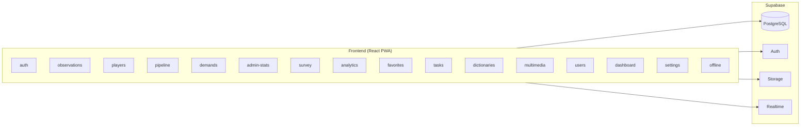

# Architektura techniczna

## Przegląd

Architektura opiera się o PWA (React) i backend Supabase. Hosting frontendu jest na Vercel.

```
Client (PWA React) → Supabase (PostgreSQL + Auth + Storage + Realtime) → Hosting (Vercel)
```

## Stos technologiczny

### Frontend

- React 18 + TypeScript + Vite
- Tailwind CSS + shadcn/ui
- React Router, React Query, React Hook Form, Zod
- Zustand (state), Dexie (IndexedDB)
- Workbox (Service Worker)

### Backend

- Supabase: PostgreSQL, Auth (GoTrue), PostgREST, Storage, Realtime
- Edge Functions dla logiki niestandardowej (zaproszenia)

### Hosting i CI

- Vercel (deploy frontendu)
- GitHub (repo i workflowy)

## Struktura projektu (skrót)

```
scoutpro/
  src/
    components/
    features/
    hooks/
    lib/
    pages/
    stores/
    types/
  public/
  supabase/
    migrations/
```

## Moduły funkcjonalne

| Moduł | Odpowiedzialność |
|-------|------------------|
| **auth** | Logowanie, zaproszenia, reset hasła |
| **observations** | Wizard obserwacji, lista, edycja |
| **players** | Profile zawodników, edycja |
| **pipeline** | Statusy pipeline, historia |
| **demands** | Zapotrzebowania na zawodników (CRUD, kandydaci) |
| **admin-stats** | Statystyki użytkowników (sesje, logowania, rozliczenia miesięczne) |
| **survey** | Ankieta satysfakcji (can_submit, submit, wyniki dla admina) |
| **analytics** | Metryki rekrutacji, lejek, heatmapa, Sankey, ustawienia |
| **favorites** | Listy ulubionych zawodników |
| **tasks** | Zadania powiązane z zawodnikami |
| **dictionaries** | Słowniki (regiony, ligi, kategorie, kluby, pozycje, kryteria ocen, dict_*) |
| **multimedia** | Zdjęcia/wideo (tabela `multimedia`, bucket `scoutpro_media`) |
| **users** | Zarządzanie użytkownikami (admin) |
| **dashboard** | KPI i widoki podsumowań |
| **settings** | Ustawienia, słowniki, użytkownicy |
| **offline** | Kolejka operacji offline i synchronizacja |

## Diagram modułów i przepływu



## Bezpieczeństwo

- RLS włączone na tabelach publicznych.
- Polityki admina oparte o `public.is_admin()`.
- Operacje słownikowe i zarządzanie użytkownikami ograniczone do admina.
- RPC statystyk, ankiet i analityki – dostęp zgodnie z politykami (admin / authenticated).

## Integracje i dane

- **REST:** API generowane przez Supabase PostgREST (tabele: players, observations, matches, słowniki, users, player_demands, multimedia, favorite_lists, tasks itd.).
- **RPC:** Funkcje PostgreSQL dla statystyk użytkowników, sesji, ankiet, analityki rekrutacji, ustawień analityki (szczegóły w `06-api-contracts.md` / `api-spec.md`).
- Kluczowe obszary danych opisane w `data-model.md`.
