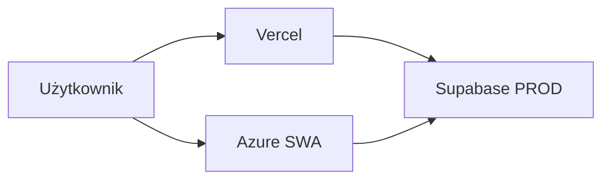

# Migracja ScoutApp do Azure – przegląd

## Cel

- **Dual hosting**: utrzymanie wdrożenia na **Vercel** oraz dodanie wdrożenia na **Azure Static Web Apps** (SWA) w grupie zasobów `RG-KSP-PROD-SCOUTING`.
- Oba fronty (Vercel i Azure SWA) łączą się z **tą samą produkcyjną instancją Supabase** – bez tworzenia nowego projektu Supabase w pierwszej fazie.
- W późniejszej fazie planowana jest migracja do „właściwej” bazy produkcyjnej (nowy projekt Supabase); dokumentacja z tego wątku służy do wniosków i instrukcji przy podobnych projektach.

## Architektura (faza 1)

- **Vercel**: bez zmian; deploy z brancha `master`, zmienne środowiskowe jak dotąd.
- **Azure SWA**: nowy front; CI/CD z Azure DevOps (repo mirror, pipeline YAML); zmienne z variable group (ten sam `VITE_SUPABASE_URL`, `VITE_SUPABASE_ANON_KEY`, `VITE_APP_URL` = adres SWA).
- **Supabase PROD**: jeden projekt; w Auth dodane Redirect URLs i (w razie potrzeby) CORS dla adresu Azure SWA.

## Fazy

| Faza | Opis |
|------|------|
| **1** | Dual fronty: Vercel + Azure SWA, wspólna baza Supabase PROD. Konfiguracja SWA, pipeline ADO, konfiguracja Supabase pod drugi frontend. |
| **2** | (Później) Nowy projekt Supabase PROD: migracja schematu, auth, danych, storage; przełączenie Vercel i Azure na nowe URL/klucze. Zob. [runbooks/future-supabase-prod-migration.md](runbooks/future-supabase-prod-migration.md). |

## Powiązane dokumenty

- [runbooks/azure-swa-setup.md](runbooks/azure-swa-setup.md) – utworzenie SWA, Deployment Token
- [runbooks/azure-swa-ci-cd.md](runbooks/azure-swa-ci-cd.md) – pipeline, variable group
- [runbooks/supabase-prod-config-for-multi-frontends.md](runbooks/supabase-prod-config-for-multi-frontends.md) – Redirect URLs, CORS dla Azure
- [runbooks/future-supabase-prod-migration.md](runbooks/future-supabase-prod-migration.md) – scenariusz migracji bazy (faza 2)
- [azure-migration-log.md](azure-migration-log.md) – dziennik decyzji, problemów i rozwiązań
