# Dokument architektury importu danych (ScoutPro)

## 1. Cel dokumentu

Dokument opisuje docelową architekturę jednorazowego importu danych historycznych do ScoutPro z pliku zewnętrznego (przykład: `Import akademia.csv`) oraz model wielokrotnego użytku na przyszłość.

Zakres:
- import uruchamiany po stronie serwera (Node/TS lub Edge Function),
- autoryzacja przez `service role` (ominięcie RLS podczas zapisu),
- pipeline `staging -> transform -> load -> reporting`,
- możliwość przypisania importu do obszaru `AKADEMIA` lub `SENIOR`,
- pełny audyt importu i raport kolumn mapowanych/niemmapowanych.

## 2. Źródła prawdy w repo

Najważniejsze pliki referencyjne:
- Schemat bazowy i enumy: `scoutpro/supabase/migrations/20260101000000_init_schema.sql`
- Podział obszarów i polityki area gate: `scoutpro/supabase/migrations/20260319000003_area_access_academy_senior.sql`
- Funkcje roli/obszaru (z metadata auth): `scoutpro/supabase/migrations/20260319000009_fix_area_and_role_functions_no_drop.sql`
- Observation v2: `scoutpro/supabase/migrations/20260229100000_observation_v2_schema.sql`
- Istniejące wzorce skryptowe: `scoutpro/scripts/migrate-data.ts`, `scoutpro/scripts/import-excel.ts`

## 3. Model danych ScoutPro pod import

### 3.1 Tabele docelowe (minimum dla importu CSV)

- `public.players`
  - wymagane: `first_name`, `last_name`, `birth_year`
  - krytyczne importowo: `club_id`, `region_id`, `age_category_id`, `primary_position`, `dominant_foot`, `created_by`, `pipeline_status`
- `public.observations`
  - wymagane: `player_id`, `scout_id`, `source`, `observation_date`
  - krytyczne importowo: `notes`/`summary`, `potential_now`, `potential_future`, `rank`, `observation_category`, `form_type`
- słowniki/referencje:
  - `public.clubs`, `public.leagues`, `public.categories`, `public.regions`, `public.users`

### 3.1.1 `public.players` – pełna lista pól (pod mapowanie)

Źródło: `scoutpro/supabase/migrations/20260101000000_init_schema.sql` + migracje rozszerzające (m.in. `20260319000003_area_access_academy_senior.sql`, `20260305000000_players_created_by.sql`, `20260303000000_players_agent_social_body_build.sql`, `20260229100000_observation_v2_schema.sql`).

- **Identyfikacja i metryki**
  - `id` (uuid, PK)
  - `created_at` (timestamptz)
  - `updated_at` (timestamptz)
  - `created_by` (uuid → `public.users.id`, nullable)
- **Dane podstawowe**
  - `first_name` (text, NOT NULL)
  - `last_name` (text, NOT NULL)
  - `birth_year` (int, NOT NULL)
  - `birth_date` (date, nullable)
  - `nationality` (text, nullable)
- **Obszar i kategoria (RLS/area gate)**
  - `age_category_id` (uuid → `public.categories.id`, nullable) – krytyczne dla spójności obszaru `AKADEMIA/SENIOR`
- **Klub/region**
  - `club_id` (uuid → `public.clubs.id`, nullable)
  - `region_id` (uuid → `public.regions.id`, nullable)
- **Pozycje**
  - `primary_position` (text, nullable)
  - `secondary_positions` (text[], nullable)
- **Parametry fizyczne**
  - `height_cm` (int, nullable)
  - `weight_kg` (numeric(4,1), nullable)
  - `body_build` (text, nullable; słownik: `public.dict_body_build`)
- **Kontakt opiekuna**
  - `guardian_name` (text, nullable)
  - `guardian_phone` (text, nullable)
  - `guardian_email` (text, nullable)
- **Kontakt agenta**
  - `agent_name` (text, nullable)
  - `agent_phone` (text, nullable)
  - `agent_email` (text, nullable)
- **Linki / social**
  - `transfermarkt_url` (text, nullable)
  - `facebook_url` (text, nullable)
  - `instagram_url` (text, nullable)
  - `other_social_url` (text, nullable)
- **Media (profile)**
  - `photo_urls` (text[], nullable)
  - `video_urls` (text[], nullable)
- **Pipeline / decyzje**
  - `pipeline_status` (enum `public.pipeline_status`, NOT NULL, ma default)
  - `decision_status` (text, nullable)
  - `decision_notes` (text, nullable)
- **Cechy piłkarskie**
  - `dominant_foot` (enum `public.dominant_foot`, nullable)
  - `contract_end_date` (date, nullable)

### 3.1.2 `public.observations` – pełna lista pól (pod mapowanie)

Źródło: `scoutpro/supabase/migrations/20260101000000_init_schema.sql` + `20260229100000_observation_v2_schema.sql` oraz migracje audit/fields.

Minimalne i krytyczne:
- **Identyfikacja**
  - `id` (uuid, PK)
  - `player_id` (uuid → `public.players.id`, NOT NULL)
  - `scout_id` (uuid → `public.users.id`, NOT NULL)
  - `created_at`, `updated_at`, `synced_at`, `is_offline_created`
- **Klasyfikacja**
  - `source` (enum `public.observation_source`)
  - `observation_date` (date)
  - `status` (text)
  - `observation_category` (enum, v2)
  - `form_type` (enum, v2)
  - `match_observation_id` (uuid → `public.match_observations.id`, nullable)
- **Treść i oceny**
  - `notes`, `summary`
  - `rank`, `recommendation`
  - `potential_now`, `potential_future`
  - `overall_rating` (legacy) oraz pola motor/mental/technical/tactical (jeśli używane)
- **Audit display**
  - `created_by`, `created_by_name`, `created_by_role`
  - `updated_by`, `updated_by_name`, `updated_by_role`

### 3.1.3 Słowniki/tabele referencyjne istotne dla importu

- **Obszar/kategorie**: `public.categories` (ma `area`, `is_active`, reguły wieku: `age_under` / `min_birth_year` / `max_birth_year`)
- **Kluby/ligi**: `public.clubs`, `public.leagues` (obszar `area`, aktywność)
- **Regiony**: `public.regions`
- **Użytkownicy**: `public.users` + krytycznie: metadane w `auth.users` (funkcje `current_business_role()`, `current_area_access()`, `is_admin()`)
- **Słowniki domenowe** (jeśli w danych zewnętrznych istnieją odpowiedniki):
  - `public.dict_body_build` (dla `players.body_build`)
  - `public.positions` / `public.position_dictionary` (jeśli mapujesz pozycje do słowników aplikacji)
  - inne `dict_*` (np. decyzje rekrutacyjne / role zespołowe) – mapować tylko jeśli import obejmie te moduły

### 3.2 Relacje i ograniczenia istotne dla ETL

- `observations.player_id -> players.id` (FK)
- `observations.scout_id -> users.id` (FK, obowiązkowe)
- `players.club_id -> clubs.id` (FK)
- `players.region_id -> regions.id` (FK)
- `players.age_category_id -> categories.id` (FK)

Krytyczne ograniczenia:
- enumy (`pipeline_status`, `observation_source`, `dominant_foot`, `recommendation_type`, itd.),
- zakresy ocen (część pól ma check 1..5 lub skale połówkowe),
- polityki obszarowe (`AKADEMIA`/`SENIOR`) dla widoczności i modyfikacji.

### 3.3 RLS i service role

- Import wykonujemy przez `SUPABASE_SERVICE_ROLE_KEY`.
- `service role` omija RLS, ale nie omija:
  - FK,
  - enum/check constraints,
  - unique constraints.

Wniosek: walidacja jakości i referencji musi być wykonana przed zapisem do tabel produkcyjnych.

### 3.4 Diagram przepływu danych

```mermaid
flowchart LR
  SourceFile["Import akademia.csv"] --> StagingRaw["stg_import_rows (raw jsonb)"]
  StagingRaw --> Canonical["stg_import_canonical"]
  Canonical --> Dictionaries["clubs/categories/regions/users lookup"]
  Dictionaries --> LoadPlayers["upsert players"]
  LoadPlayers --> LoadObservations["insert/upsert observations"]
  LoadObservations --> Reconcile["scout reconciliation"]
  Reconcile --> ImportReport["import_run_report + import_row_errors"]
```

## 4. Kanoniczny model importu (CSV -> canonical -> DB)

## 4.1 Parametry wejściowe uruchomienia

Wymagane parametry joba:
- `import_batch_id` (UUID),
- `source_file_name`,
- `target_area` (`AKADEMIA` lub `SENIOR`),
- `run_mode` (`dry_run`/`commit`),
- `placeholder_scout_user_id` (konto techniczne do fallbacku).

## 4.2 Mapa kolumn dla `Import akademia.csv`

| Kolumna źródłowa | Pole canonical | Tabela docelowa | Typ docelowy | Wymagalność | Reguły normalizacji / walidacji |
|---|---|---|---|---|---|
| `Nazwisko` | `last_name` | `players.last_name` | `text` | wymagane | trim, collapse spaces, title-case opcjonalnie |
| `Imię` | `first_name` | `players.first_name` | `text` | wymagane | trim, collapse spaces |
| `Rocznik` | `birth_year` | `players.birth_year` | `int` | wymagane | wyciągnięcie cyfr, zakres 1980..(current_year) |
| `Klub` | `club_name_raw` | `players.club_id` (po lookup) | `uuid` | opcjonalne | normalizacja nazwy, lookup/upsert w `clubs` |
| `Kadra` | `region_name_raw` | `players.region_id` (po lookup) | `uuid` | opcjonalne | mapowanie nazw regionów, słownik aliasów |
| `Pozycja` | `position_raw` | `players.primary_position` | `text` | opcjonalne | mapowanie kodów (`1`,`6/8`,`4/5/2`) do formatu aplikacji |
| `Noga` | `dominant_foot` | `players.dominant_foot` | enum | opcjonalne | `prawa->right`, `lewa->left`, `obie->both` |
| `Data obserwacji` | `observation_date` | `observations.observation_date` | `date` | zalecane | parser `dd.mm.yyyy`, fallback do daty importu |
| `Rodzaj` | `observation_kind_raw` | `observations.source` / metadata | enum/text | opcjonalne | jeśli brak 1:1 mapy, `source='scouting'`, a surową wartość zachowaj w jsonb |
| `Performance` | `potential_now` | `observations.potential_now` | `int/numeric` | opcjonalne | parse number, walidacja zakresu modelu |
| `Potencjał przyszły` | `potential_future` | `observations.potential_future` | `int/numeric` | opcjonalne | parse number lub `null` |
| `Opis` | `notes_raw` | `observations.notes`/`summary` | `text` | opcjonalne | trim, usunięcie znaków sterujących |
| `Scout` | `scout_name_raw` | `observations.scout_id` (po mapowaniu) | `uuid` | wymagane logicznie | mapowanie do usera; fallback na konto techniczne |
| `DOB` | `birth_date_raw` | `players.birth_date` (opcjonalnie) | `date/text` | opcjonalne | jeśli `b.d.` -> `null` |
| `Miesiąc` | `month_raw` | brak bezpośredniego pola | `text/int` | nie | zachować w `raw_payload jsonb` + raporcie unmapped |

> Uwaga: `Import akademia.csv` nie zawiera kolumn `Wzrost`, `Waga`, `Narodowość`. W aplikacji pola istnieją (`players.height_cm`, `players.weight_kg`, `players.nationality`) i **powinny być ujęte w specyfikacji mapowania dla innych źródeł**. Jeżeli w kolejnych plikach pojawią się takie kolumny, mapuj je bezpośrednio:
> - `Wzrost` -> `players.height_cm` (int)
> - `Waga` -> `players.weight_kg` (numeric(4,1))
> - `Narodowość` -> `players.nationality` (text)

### 4.3 Klucze deduplikacji (canonical)

- Klucz zawodnika (proponowany):  
  `normalized(first_name,last_name,birth_year,club_name_normalized)`
- Klucz obserwacji (proponowany idempotency key):  
  `hash(player_key + observation_date + scout_name_raw + description_excerpt)`

## 5. Architektura ETL: staging -> transform -> load -> reporting

## 5.1 Tabele techniczne (rekomendowane)

- `import_runs`
  - `id`, `source_file`, `target_area`, `run_mode`, `status`, `started_at`, `finished_at`, `stats jsonb`
- `stg_import_rows`
  - `run_id`, `row_no`, `sheet_or_file`, `raw_payload jsonb`, `parse_status`, `parse_errors jsonb`
- `stg_import_canonical`
  - pola canonical po normalizacji + `mapping_status`, `mapping_errors jsonb`
- `import_row_errors`
  - `run_id`, `row_no`, `stage`, `error_code`, `error_message`, `raw_payload jsonb`
- `import_column_mapping_audit`
  - `run_id`, `source_column`, `target_field`, `mapped_count`, `unmapped_count`, `notes`

## 5.2 Przebieg etapów

1. **Preflight**
   - walidacja kodowania pliku (`cp1250`/`utf-8`),
   - walidacja nagłówków,
   - walidacja parametrów uruchomienia (`target_area`, `placeholder_scout_user_id`).
2. **Ingest to staging raw**
   - zapis wszystkich wierszy do `stg_import_rows.raw_payload`.
3. **Canonical transform**
   - mapowanie kolumn, parse dat/liczb, normalizacja nazw i słowników.
4. **Reference resolution**
   - lookup/upsert `clubs`, mapowanie `regions`, wyznaczenie `age_category_id` wg `target_area`.
5. **Load**
   - upsert `players`,
   - insert/upsert `observations`,
   - transakcje per batch.
6. **Reporting**
   - zapis metryk i błędów per etap/per kolumna.

## 5.3 Wydajność i niezawodność

- batch size: 200-1000 (zależnie od encji),
- retry z backoff dla błędów przejściowych,
- checkpointy per etap (`resume` po awarii),
- idempotentne klucze importu,
- `dry_run` wymagany przed `commit`,
- fail-fast tylko dla błędów krytycznych (schema mismatch), a row-level errors trafiają do raportu.

## 6. Strategia scoutów nieobecnych w systemie (wybrana)

Wybrana polityka: **konto techniczne placeholder + późniejszy remap**.

### 6.1 Zasady podczas importu

- Jeżeli `scout_name_raw` nie mapuje się do istniejącego użytkownika:
  - ustaw `observations.scout_id = placeholder_scout_user_id`,
  - zapisz oryginał w:
    - `observations.created_by_name` (jeśli używane),
    - `stg_import_canonical.scout_name_raw`,
    - tabeli mapowań `import_scout_identity_map`.

### 6.2 Tabela mapowania tożsamości (rekomendowana)

- `import_scout_identity_map`
  - `run_id`
  - `scout_name_raw`
  - `resolved_user_id` (nullable)
  - `resolution_status` (`mapped`/`placeholder`)
  - `resolved_at`

### 6.3 Reconciliation po utworzeniu kont użytkowników

Po utworzeniu właściwego użytkownika:
- aktualizacja historycznych rekordów:
  - `observations.scout_id` z placeholdera na `resolved_user_id`,
  - opcjonalnie `created_by`/`updated_by`, jeśli wymagane analitycznie.
- ponowne przeliczenie statystyk lub cache raportów.

Efekt: po zalogowaniu właściwy użytkownik widzi swoje rekordy.

## 7. Obsługa danych nadmiarowych (więcej informacji niż model aplikacji)

Każdy rekord musi zachować pełny `raw_payload jsonb`, nawet jeśli:
- kolumna nie ma mapowania,
- wartość nie przechodzi walidacji,
- decyzja biznesowa odkłada wykorzystanie pola na później.

Raport ma osobną sekcję:
- `Mapped columns`,
- `Unmapped columns`,
- `Dropped values (with reason)`.

## 8. Raportowanie importu (wymagane artefakty)

## 8.1 Metryki globalne runa

- liczba wszystkich wierszy,
- `parsed_ok`, `parsed_error`,
- `players_inserted`, `players_updated`,
- `observations_inserted`, `observations_updated`,
- `rows_rejected`, `rows_placeholder_scout`,
- `columns_mapped`, `columns_unmapped`.

## 8.2 Raport szczegółowy

- raport per wiersz (błędy),
- raport per kolumna (mapowanie i coverage),
- raport per encja (insert/update/reject),
- lista klubów/słowników utworzonych automatycznie,
- lista rekordów wymagających ręcznej decyzji.

## 9. Runbook krok po kroku (operacyjny)

1. Przygotuj plik wejściowy i wybierz `target_area` (`AKADEMIA`/`SENIOR`).
2. Uzupełnij env (`SUPABASE_URL`, `SUPABASE_SERVICE_ROLE_KEY`, `PLACEHOLDER_SCOUT_USER_ID`).
3. Uruchom preflight i walidację nagłówków.
4. Uruchom `dry_run`:
   - staging raw,
   - canonical transform,
   - raport mapowań i błędów.
5. Zatwierdź reguły mapowania i słowniki.
6. Uruchom `commit`:
   - batch upsert `players`,
   - batch insert/upsert `observations`,
   - zapis audytu i statystyk.
7. Wykonaj walidację po imporcie:
   - kontrole ilościowe,
   - kontrole jakościowe próbek.
8. Wykonaj reconciliation scoutów z placeholdera na docelowe konta.
9. Wygeneruj raport końcowy i podpisz odbiór importu.

## 10. Checklist wdrożeniowy dla architekta/implementatora

- [ ] Zdefiniowano tabele `import_runs`, `stg_import_rows`, `stg_import_canonical`, `import_row_errors`.
- [ ] Zaimplementowano parser CSV z obsługą kodowania CP1250.
- [ ] Zaimplementowano canonical mapping + walidacje.
- [ ] Zaimplementowano idempotencję i klucze deduplikacji.
- [ ] Zaimplementowano politykę `placeholder_scout_user_id`.
- [ ] Dostępny `dry_run` i raport per kolumna.
- [ ] Runbook wykonany end-to-end na próbce.
- [ ] Import produkcyjny zakończony raportem i podpisem.

## 11. Uwagi końcowe

- Import ma być deterministyczny i możliwy do wznowienia.
- Brak mapowania pola nie może oznaczać utraty danych: wszystko zostaje w `jsonb`.
- Decyzje o rozszerzeniu modelu aplikacji podejmować dopiero po analizie raportu `unmapped`.
